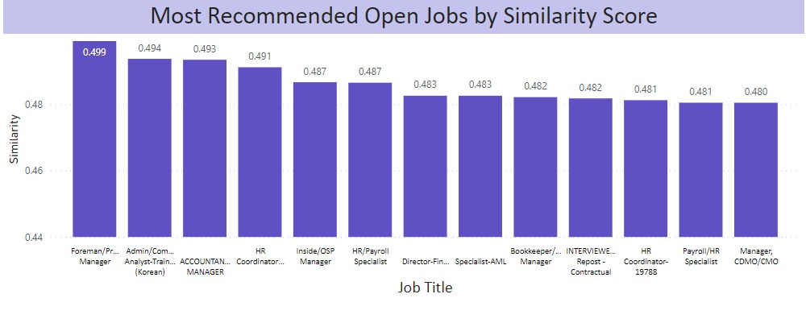
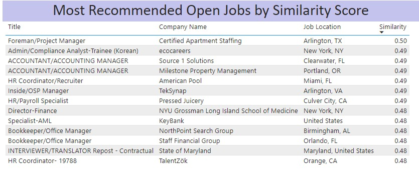
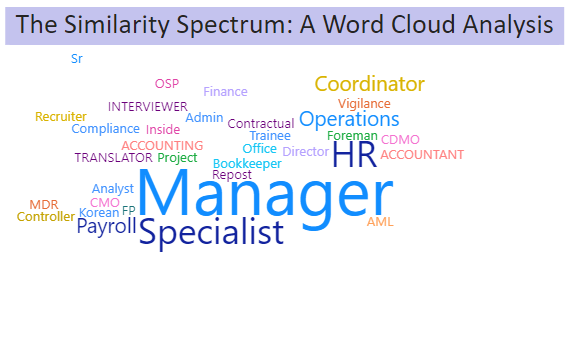

<h1 align='center' style="text-align:center; font-weight:bold; font-size:2.5em"> The Job Advisor<br>Final Project Lab Data Collection </h1>

<p align='center' style="text-align:center;font-size:1em;">
    <a>Amit Zalle</a>&nbsp;,&nbsp;
    <a>Shalev Hermon</a>&nbsp;,&nbsp;
    <a>Raz Biton</a>&nbsp;&nbsp;
    
    
    
</p>


# Contents

- [Overview](#overview)
- [JobScraping](#JobScraping)
- [Profiles Similarity](#ProfilesSimilarity)
- [Job Matching](#JobMatching)
- [Word2Vec Similarity] (#Word2VecJobSimilarity)
- [Output Reccomended Open Jobs] (#Output Reccomended Open Jobs)
- [([Project Report.pdf](https://github.com/its-Raz/The-Job-Advisor/blob/f197cdc85fad47573d7ed96f47640e9e2809c4fb/Project%20Report.pdf))]

# Overview

**Job Advisor Overiew**

1. Clone this repository and 

   ```bash
   git clone https://github.com/its-Raz/The-Job-Advisor.git
   cd multimodal_injection
   ```
2. verify you use python 3.8 or above and pip install the following:

   ```bash
   pip install playwright.async_api
   pip install bs4
   pip install pandas
   pip install tkinter
   ```   


# JobScraping

In order to scrape job you will need to have accsess to bright data Web Browser. If you want to skip this part, you can use the pre-scraped `all_jobs.csv` in the `JobScraper` folder or in `data` folder

1. Enter `JobScraper` folder then `main.py`, at the top of the file, below all imports please add your Bright Data log in details:
jobs to scrape from each site:
    ```
       username='ENTER USERNAME'
       password='ENTER PASSWORD'
       auth=f'{username}:{password}'
       host = 'brd.superproxy.io:9222'
       browser_url = f'wss://{auth}@{host}'
   ```
2. Below login details, configure number of jobs to scrape from each site, you can leave it to default value (10).
   
    
|                    Image Example                        | 
| :------------------------------------------------------ | 
|                 |

3. Run main.py

4. Press `Next` till you reach the last window, you can leave all fields empty but `Locaiton`,`Profile URL`, and `Keywords`, after filling them, press `Next`
   till button is grayed out, then press `Submit`:
   
|                    Image Example                        | 
| :------------------------------------------------------ | 
|                  |

6. Job Advisor will start scraping and will save the data to same folder, you can inspect list of jobs from each site or all combined.


1. Enter `JobScraper` folder then `main.py`, at the top of the file, below all imports please add your Bright Data log in details:
jobs to scrape from each site:
    ```
       username='ENTER USERNAME'
       password='ENTER PASSWORD'
       auth=f'{username}:{password}'
       host = 'brd.superproxy.io:9222'
       browser_url = f'wss://{auth}@{host}'
   ```
2. Below login details, configure number of jobs to scrape from each site, you can leave it to default value (10).
   
    
|                    Image Example                        | 
| :------------------------------------------------------ | 
|                 |

3. Run main.py

4. Press `Next` till you reach the last window, you can leave all fields empty but `Locaiton`,`Profile URL`, and `Keywords`, after filling them, press `Next`
   till button is grayed out, then press `Submit`:
   
|                    Image Example                        | 
| :------------------------------------------------------ | 
|                  |

6. Job Advisor will start scraping and will save the data to same folder, you can inspect list of jobs from each site or all combined.
   
# JobMatching

1. Enter `JobScraper` folder then `main.py`, at the top of the file, below all imports please add your Bright Data log in details:
jobs to scrape from each site:
    ```
       username='ENTER USERNAME'
       password='ENTER PASSWORD'
       auth=f'{username}:{password}'
       host = 'brd.superproxy.io:9222'
       browser_url = f'wss://{auth}@{host}'
   ```
2. Below login details, configure number of jobs to scrape from each site, you can leave it to default value (10).
   
    
|                    Image Example                        | 
| :------------------------------------------------------ | 
|                 |

3. Run main.py

4. Press `Next` till you reach the last window, you can leave all fields empty but `Locaiton`,`Profile URL`, and `Keywords`, after filling them, press `Next`
   till button is grayed out, then press `Submit`:
   
|                    Image Example                        | 
| :------------------------------------------------------ | 
|                  |

6. Job Advisor will start scraping and will save the data to same folder, you can inspect list of jobs from each site or all combined.
7. after you get the all_jobs.csv file, run Run companies_scraping.py file - scrape the companies data
8. This file will save you in the same folder the companies scraping details

# First Model - bm25 - Amit
# Profiles Similarity

AMIT ENTER YOUR INSTRUCTIONS HERE 

 
 # Word2VecJobSimilarity
 After you get the similar_people.csv dataset from the previous model:
 This part using the linkedin_jobs_scraping.csv, all_companies_scraping.csv, similar_people.csv 
 1. run the file extracting_past_jobs.py to implement the feature extraction of descriptions from the linkedin.csv dataset
 2. run Word2Vec_Job_Similarity.py to implement the word2vec similarity between the open positions from scraping, and the descriptions of past jobs of similar people
 3. the code will output in the same folder a file Most_similar_jobs_profile.csv with the most reccomended open jobs for the user

# Output Reccomended Open Jobs






 
