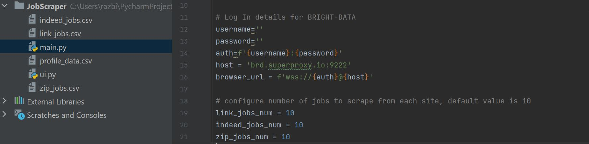
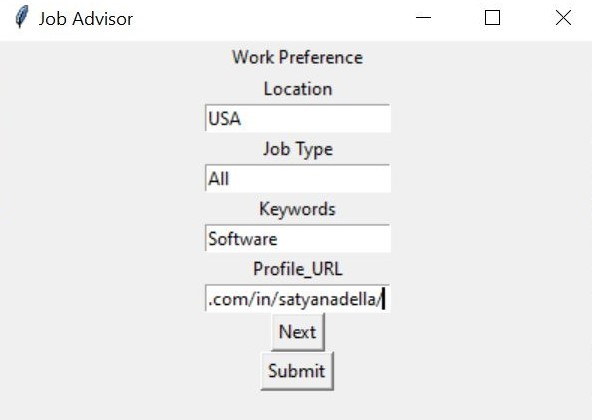

<h1 align='center' style="text-align:center; font-weight:bold; font-size:2.5em"> The Job Advisor<br>Final Project Lab Data Collection </h1>

<p align='center' style="text-align:center;font-size:1em;">
    <a>Amit Zalle</a>&nbsp;,&nbsp;
    <a>Shalev Hermon</a>&nbsp;,&nbsp;
    <a>Raz Biton</a>&nbsp;&nbsp;
    
    
    
</p>

[([Project Report.pdf](https://github.com/its-Raz/The-Job-Advisor/blob/f197cdc85fad47573d7ed96f47640e9e2809c4fb/Project%20Report.pdf))]


# Contents

- [Overview](#overview)
- [JobScraping](#JobScraping)
- [Other Examples](#other-examples)
- [Citation](#citation)

# Overview

**Job Advisor Overiew**

1. Clone this repository and 

   ```bash
   git clone https://github.com/ebagdasa/multimodal_injection.git
   cd multimodal_injection
   ```
2. Create env

   ```bash
   git clone https://github.com/ebagdasa/multimodal_injection.git
   cd multimodal_injection
   ```   


# JobScraping

In order to scrape job you will need to have accsess to bright data Web Browser. If you want to skip this part, you can use the pre-scraped csv files in the `JobScraper` folder.

1. Enter `JobScraper` folder then `main.py`, at the top of the file, below all imports please add your Bright Data log in details:
jobs to scrape from each site:
    ```
       username='ENTER USERNAME'
       password='ENTER PASSWORD'
       auth=f'{username}:{password}'
       host = 'brd.superproxy.io:9222'
       browser_url = f'wss://{auth}@{host}'
   ```
2. Below login details, configure number of jobs to scrape from each site, you can leave it to default value (10).
   
    
|                    Image Example                        | 
| :------------------------------------------------------ | 
|                 |

3. Run main.py

4. Press `Next` till you reach the last window, you can leave all fields empty but `Locaiton`,`Profile URL`, and `Keywords`, after filling them, press `Next`
   till button is grayed out, then press `Submit`:
   
|                    Image Example                        | 
| :------------------------------------------------------ | 
|                  |

6. Job Advisor will start scraping and will save the data to csv file.


